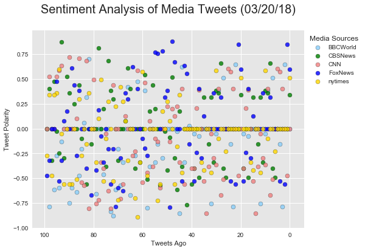
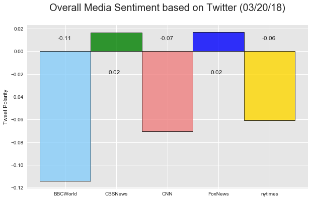

# News Mode

1. As of today, CBCNew and FoxNews are slightly positive, and other three are somehow negative
2. Among all news organizations, BBSWord is the most negative
4. There are significant number of neturls when all media

BTW:

- I could not find exact match for BBC, so I use BBCWord instead.
- For CBS, I pick CBSNews instead of CBS as CBS in general include not just news, but also entertainments etc.
- There is no twitter handle called FOX, so I pick FoxNews instead
- For nytimnes, I see the example use 'New York Times' and "NYT' but I stil to nytimes, as it is more consistent this way.

## Imports


```python
# Core
from datetime import date
from operator import itemgetter
import json

# Numpy, Pandas and PyPlot
import numpy as np
import pandas as pd
import matplotlib.pyplot as plt
import seaborn as sns

sns.set()
sns.set_style(
    'darkgrid', 
    {
        'axes.facecolor': '0.9',
    }
)

# API
import tweepy
from textblob import TextBlob
from vaderSentiment.vaderSentiment import SentimentIntensityAnalyzer

# Own
from twitter_config import *
```

## Gobals & Constants


```python
PAGE_SIZE = 20
PAGES = 5
MEDIA_SOURCES = ['BBCWorld', 'CBSNews', 'CNN', 'FoxNews', 'nytimes']
SCORES = ['compound', 'neg', 'pos', 'neu']

COLORS = {
    'BBCWorld': 'lightskyblue',
    'CBSNews': 'green',
    'CNN': 'lightcoral',
    'FoxNews': 'blue',
    'nytimes': 'gold'
}

TODAY = date.today().strftime('%m/%d/%y')

_AUTH = tweepy.OAuthHandler(TWITTER_CONSUMER_KEY, TWITTER_CONSUMER_SECRET)
_AUTH.set_access_token(TWITTER_ACCESS_TOKEN, TWITTER_TOKEN_SECRET)

TWITTER_API = tweepy.API(_AUTH, parser=tweepy.parsers.JSONParser())
SENTIMENT_ANALYZER = SentimentIntensityAnalyzer()
```

## Gather Data
Use multil-index to better organize the data


```python
df = pd.DataFrame(
    index=pd.MultiIndex.from_product(
        [MEDIA_SOURCES, list(range(PAGE_SIZE * PAGES))],
        names=['Media Sources', 'Tweets Ago']
    ),
    columns=SCORES
)

for media_source in MEDIA_SOURCES:
    tweets_ago = 0
    for page in range(PAGES):
        for tweet in TWITTER_API.user_timeline(media_source, count=PAGE_SIZE, page=page):
            df.loc[(media_source, tweets_ago), SCORES] = itemgetter(*SCORES)(
                SENTIMENT_ANALYZER.polarity_scores(tweet['text']))
            tweets_ago += 1    
df.head()
```


<div>
<style>
    .dataframe thead tr:only-child th {
        text-align: right;
    }

    .dataframe thead th {
        text-align: left;
    }

    .dataframe tbody tr th {
        vertical-align: top;
    }
</style>
<table border="1" class="dataframe">
  <thead>
    <tr style="text-align: right;">
      <th></th>
      <th></th>
      <th>compound</th>
      <th>neg</th>
      <th>pos</th>
      <th>neu</th>
    </tr>
    <tr>
      <th>Media Sources</th>
      <th>Tweets Ago</th>
      <th></th>
      <th></th>
      <th></th>
      <th></th>
    </tr>
  </thead>
  <tbody>
    <tr>
      <th rowspan="5" valign="top">BBCWorld</th>
      <th>0</th>
      <td>0</td>
      <td>0</td>
      <td>0</td>
      <td>1</td>
    </tr>
    <tr>
      <th>1</th>
      <td>0</td>
      <td>0</td>
      <td>0</td>
      <td>1</td>
    </tr>
    <tr>
      <th>2</th>
      <td>0.6486</td>
      <td>0</td>
      <td>0.469</td>
      <td>0.531</td>
    </tr>
    <tr>
      <th>3</th>
      <td>-0.7845</td>
      <td>0.496</td>
      <td>0</td>
      <td>0.504</td>
    </tr>
    <tr>
      <th>4</th>
      <td>-0.1531</td>
      <td>0.292</td>
      <td>0.236</td>
      <td>0.472</td>
    </tr>
  </tbody>
</table>
</div>


```python
### Export to CSV
```


```python
df.to_csv('NewsMode.csv')
```

### Sentiment Scater Plot


```python
fig, ax = plt.subplots(figsize=(8, 6))

for media_source in MEDIA_SOURCES:
    df_media = df.loc[media_source]
    ax.scatter(
        x=df_media.index,
        y=df_media['compound'],
        c=COLORS[media_source],
        marker='o',
        alpha=0.8,
        edgecolor='black',
        label=media_source
    )

ax.legend(
    title='Media Sources',
    bbox_to_anchor=(1.22, 1)
)

plt.gca().invert_xaxis()
plt.title(f'Sentiment Analysis of Media Tweets ({TODAY})\n', fontsize=20)
plt.xlabel('Tweets Ago')
plt.ylabel('Tweet Polarity')
plt.savefig('NewsMode_scatter.png', bbox_inches='tight')
plt.show()
```





### Sentiment Overall


```python
df_mean = pd.to_numeric(df['compound']).groupby('Media Sources').mean()
df_mean
```


    Media Sources
    BBCWorld   -0.114162
    CBSNews     0.016635
    CNN        -0.070667
    FoxNews     0.016704
    nytimes    -0.060800
    Name: compound, dtype: float64


```python
fig, ax = plt.subplots(figsize=(10, 6))

bars = ax.bar(
    MEDIA_SOURCES,
    df_mean,
    align='edge',
    width=1,
    edgecolor='black',
    color=[COLORS[m] for m in MEDIA_SOURCES],
    linewidth=1,
    alpha=0.8,
)

plt.title(f'Overall Media Sentiment based on Twitter ({TODAY})\n',
          fontsize=20)
plt.ylabel('Tweet Polarity')
plt.xticks(np.arange(0.5, len(MEDIA_SOURCES)), rotation=0)

# Add labels
for bar in bars:
    height = bar.get_height()
    ax.text(bar.get_x() + 0.35, 
            0.01 if height < 0 else -0.02, 
            '{:.2f}'.format(height))
   
plt.savefig('NewsMode_bar.png')
plt.show()
```




